# GitHub Workflow Guide for AI Vibes

This guide explains the complete GitHub workflow for collaborating on the AI Vibes project, with special focus on AI-assisted development.

## 🎯 Overview

Our GitHub workflow is designed to maximize collaboration efficiency while leveraging AI tools like GitHub Copilot for enhanced productivity.

---

## 📅 Daily Git & GitHub Workflow Guide
*Print-friendly guide for daily development workflow*

### 🌅 Morning Routine (First Thing)
```bash
# 1. Navigate to your project
cd "C:\Users\AU000NK6\OneDrive - WSA\Documents\Python\AI_Vibes"

# 2. Check current status
git status
git branch

# 3. Switch to main branch and sync with remote
git checkout main
git pull origin main

# 4. Check if there are updates from other developers
git fetch origin
git log --oneline -5  # See recent commits

# 5. Create or switch to your feature branch
git checkout -b feature/daily-work-$(date +%Y%m%d)
# OR switch to existing branch:
# git checkout feature/your-existing-branch
```

### 💼 During the Day (Intermediate Saves)
```bash
# Every 1-2 hours or after completing a logical unit of work:

# 1. Check what you've changed
git status
git diff

# 2. Stage your changes
git add specific-file.py  # For specific files
# OR
git add .  # For all changes (use carefully)

# 3. Commit with descriptive message
git commit -m "wip: describe what you accomplished

- Brief bullet points of changes made
- Note any AI assistance used
- Mark as work-in-progress if incomplete

AI-Assistance: [Tool used, if any]
Human-Contribution: [Your specific contributions]"

# 4. Optional: Push to backup your work
git push origin feature/your-branch-name
```

### 🌆 End of Day Routine (Before Closing)
```bash
# 1. Final status check
git status

# 2. Commit any remaining work
git add .
git commit -m "feat/fix: final changes for [date]

- Summarize all work completed today
- List any remaining TODOs
- Note testing status

AI-Assistance: [Summary of AI help received]
Human-Contribution: [Your design decisions and implementations]"

# 3. Push to GitHub (backup your work)
git push origin feature/your-branch-name

# 4. Optional: Create Pull Request if feature is complete
# Go to GitHub.com and create PR from your branch to main

# 5. Clean up (optional)
# git checkout main
# git branch -d feature/completed-branch  # Only if merged
```

### 🔄 Daily Collaboration Flow with Two Developers

```mermaid
sequenceDiagram
    participant Dev1 as Developer 1 (Klaus)
    participant Local1 as Klaus Local Git
    participant GitHub as GitHub Repository
    participant Local2 as Dev2 Local Git
    participant Dev2 as Developer 2

    Note over Dev1,Dev2: 🌅 Morning Routine
    Dev1->>Local1: git checkout main
    Dev1->>Local1: git pull origin main
    Dev1->>Local1: git checkout -b feature/klaus-work
    
    Dev2->>Local2: git checkout main
    Dev2->>Local2: git pull origin main
    Dev2->>Local2: git checkout -b feature/dev2-work

    Note over Dev1,Dev2: 💼 During the Day - Parallel Work
    loop Every 1-2 hours
        Dev1->>Local1: Edit files with AI assistance
        Dev1->>Local1: git add . && git commit
        Dev1->>GitHub: git push origin feature/klaus-work
        
        Dev2->>Local2: Edit different files
        Dev2->>Local2: git add . && git commit
        Dev2->>GitHub: git push origin feature/dev2-work
    end

    Note over Dev1,Dev2: 🔄 Mid-day Sync (if needed)
    Dev1->>GitHub: git fetch origin
    Dev1->>Local1: Check for conflicts
    alt If working on same files
        Dev1->>Dev2: Communicate about changes
        Dev1->>Local1: git merge origin/main
        Dev1->>Local1: Resolve conflicts with AI help
        Dev1->>GitHub: git push origin feature/klaus-work
    end

    Note over Dev1,Dev2: 🌆 End of Day
    Dev1->>Local1: Final git add . && git commit
    Dev1->>GitHub: git push origin feature/klaus-work
    Dev1->>GitHub: Create Pull Request (if ready)
    
    Dev2->>Local2: Final git add . && git commit
    Dev2->>GitHub: git push origin feature/dev2-work
    Dev2->>GitHub: Create Pull Request (if ready)

    Note over Dev1,Dev2: 🔍 Code Review & Integration
    Dev2->>GitHub: Review Klaus's PR
    Dev1->>GitHub: Review Dev2's PR
    GitHub->>GitHub: Merge approved PRs to main
    
    Note over Dev1,Dev2: 🔄 Next Day Preparation
    Dev1->>Local1: git checkout main && git pull
    Dev2->>Local2: git checkout main && git pull
```



### 🚨 Quick Emergency Commands
```bash
# Undo last commit (keep changes)
git reset --soft HEAD~1

# Discard all local changes (DANGEROUS!)
git checkout -- .

# Save work temporarily
git stash
git stash pop  # Restore later

# Check what others have done
git log --oneline --graph --all -10

# Quick conflict resolution
git status  # See conflicted files
# Edit files to resolve conflicts
git add .
git commit -m "resolve: merge conflicts"
```

### 💡 Daily Best Practices
- **Commit early, commit often** - Don't lose work
- **Write meaningful commit messages** - Help future you
- **Pull before pushing** - Avoid conflicts
- **Communicate with team** - Coordinate on shared files
- **Use AI attribution** - Document AI assistance
- **Test before committing** - Ensure code works
- **Push daily** - Backup your work to GitHub

### 📋 Daily Checklist
**Morning:**
- [ ] Sync with main branch (`git pull origin main`)
- [ ] Create/switch to feature branch
- [ ] Check for team updates

**During Day:**
- [ ] Commit every 1-2 hours
- [ ] Include AI attribution in commits
- [ ] Push important work to GitHub

**End of Day:**
- [ ] Final commit of all work
- [ ] Push to GitHub repository
- [ ] Create PR if feature complete
- [ ] Communicate status to team

---

## 🚀 Initial Repository Setup (Project Owner)

### Step 1: Create GitHub Repository

1. **Go to GitHub.com** and sign in to your account
2. **Click the "+" icon** in the top right corner
3. **Select "New repository"**
4. **Configure repository settings**:
   - **Repository name**: `ai-vibes`
   - **Description**: `A collaborative platform for AI-assisted software development with Vibe Coding methodology`
   - **Visibility**: Choose Public or Private
   - **Initialize**: Leave "Add a README file" **unchecked** (we already have one)
   - **Add .gitignore**: Leave **unchecked** (we have our own)
   - **Choose a license**: Leave **unchecked** (we have MIT license)
5. **Click "Create repository"**

### Step 2: Initialize Local Git Repository

Open your terminal/command prompt and navigate to your project directory:

```bash
# Navigate to your project directory
cd "C:\Users\AU000NK6\OneDrive - WSA\Documents\Python\AI_Vibes"

# Initialize Git repository
git init

# Configure Git user for this project (project-specific settings)
git config user.name "Klaus Bang Andersen"
git config user.email "klaus.bang.andersen@gmail.com"

# Optional: Set these as global defaults for all Git repositories
# git config --global user.name "Klaus Bang Andersen"
# git config --global user.email "klaus.bang.andersen@gmail.com"

# Verify the configuration
git config user.name
git config user.email

# Add all files to staging
git add .

# Create initial commit
git commit -m "feat: initial AI Vibes project setup

- Created comprehensive project structure
- Added GitHub workflow with sequence diagrams
- Implemented Vibe Coding methodology guide
- Established AI development best practices
- Generated all necessary documentation files

AI-Assistance: GitHub Copilot for documentation structure
Human-Contribution: Project design, methodology development"
```

### Step 3: Connect Local Repository to GitHub

```bash
# Add GitHub repository as remote origin
git remote add origin https://github.com/YOUR_USERNAME/ai-vibes.git

# Verify remote was added correctly
git remote -v

# Push to GitHub (first time)
git branch -M main
git push -u origin main
```

### Step 4: Configure Repository Settings

1. **Go to your repository** on GitHub.com
2. **Click "Settings" tab**
3. **Configure repository features**:

#### Branch Protection
- Go to **"Branches"** in settings
- Click **"Add rule"** for main branch
- Enable:
  - ✅ Require pull request reviews before merging
  - ✅ Require status checks to pass before merging
  - ✅ Require branches to be up to date before merging
  - ✅ Include administrators

#### Issues and Pull Requests
- Go to **"General"** in settings
- Under **"Features"** section, ensure these are enabled:
  - ✅ Issues
  - ✅ Projects
  - ✅ Wiki
  - ✅ Discussions (recommended for community)

#### Security
- Go to **"Security & analysis"**
- Enable:
  - ✅ Dependency graph
  - ✅ Dependabot alerts
  - ✅ Dependabot security updates

### Step 5: Set Up GitHub Actions (Optional)

Create a basic CI/CD workflow by adding this file:

```yaml
# .github/workflows/ci.yml
name: CI Pipeline

on:
  push:
    branches: [ main, develop ]
  pull_request:
    branches: [ main ]

jobs:
  test:
    runs-on: ubuntu-latest
    strategy:
      matrix:
        python-version: [3.8, 3.9, 3.11]

    steps:
    - uses: actions/checkout@v3
    
    - name: Set up Python ${{ matrix.python-version }}
      uses: actions/setup-python@v4
      with:
        python-version: ${{ matrix.python-version }}
    
    - name: Install dependencies
      run: |
        python -m pip install --upgrade pip
        pip install -r requirements.txt
        pip install -r requirements-dev.txt
    
    - name: Run tests
      run: |
        pytest tests/ --cov=src --cov-report=xml
    
    - name: Run linting
      run: |
        flake8 src/ tests/
        black --check src/ tests/
    
    - name: Check AI attribution
      run: |
        # Custom script to check AI attribution in commits
        echo "Checking AI attribution in recent commits..."
```

### Step 6: Configure Team Access (For Organizations)

If this is an organization repository:

1. **Go to repository Settings**
2. **Click "Manage access"**
3. **Add team members** with appropriate permissions:
   - **Admin**: Full access, can manage settings
   - **Write**: Can push to repository, create PRs
   - **Read**: Can view and clone repository

### Step 7: Create Initial Issues and Milestones

1. **Create Project Milestones**:
   - Go to **Issues** → **Milestones** → **New milestone**
   - Create milestones like:
     - `v1.0 - Core AI Integration`
     - `v1.1 - Enhanced Collaboration Tools`
     - `v2.0 - Advanced AI Features`

2. **Create Initial Issues**:
   - Use the issue templates we created
   - Add initial feature requests and tasks
   - Label them appropriately

## 🔄 Team Member Setup (Contributors)

### For New Team Members

When someone wants to contribute to the project:

### Step 1: Fork the Repository

1. **Go to the main repository** on GitHub
2. **Click "Fork" button** in the top right
3. **Choose your account** as the destination
4. **Wait for fork to complete**

### Step 2: Clone Your Fork

```bash
# Clone your forked repository
git clone https://github.com/YOUR_USERNAME/ai-vibes.git
cd ai-vibes

# Add upstream remote (original repository)
git remote add upstream https://github.com/ORIGINAL_OWNER/ai-vibes.git

# Verify remotes
git remote -v
# Should show:
# origin    https://github.com/YOUR_USERNAME/ai-vibes.git (fetch)
# origin    https://github.com/YOUR_USERNAME/ai-vibes.git (push)
# upstream  https://github.com/ORIGINAL_OWNER/ai-vibes.git (fetch)
# upstream  https://github.com/ORIGINAL_OWNER/ai-vibes.git (push)
```

### Step 3: Set Up Development Environment

```bash
# Create virtual environment
python -m venv venv

# Activate virtual environment
# Windows:
venv\Scripts\activate
# macOS/Linux:
source venv/bin/activate

# Install dependencies
pip install -r requirements.txt
pip install -r requirements-dev.txt

# Install pre-commit hooks
pre-commit install

# Test setup
python -m pytest tests/ --version
```

### Step 4: Configure Git Settings

```bash
# Set up your Git identity
git config user.name "Your Name"
git config user.email "your.email@example.com"

# Optional: Set up GPG signing for commits
git config commit.gpgsign true
git config user.signingkey YOUR_GPG_KEY_ID
```

## 📋 Workflow Steps

### 1. Project Setup
```bash
# Fork the repository
# Clone your fork
git clone https://github.com/YOUR_USERNAME/ai-vibes.git
cd ai-vibes

# Add upstream remote
git remote add upstream https://github.com/ai-vibes/ai-vibes.git

# Set up development environment
python -m venv venv
source venv/bin/activate  # Windows: venv\Scripts\activate
pip install -r requirements.txt
```

### 2. Feature Development
```bash
# Update main branch
git checkout main
git pull upstream main

# Create feature branch
git checkout -b feature/your-feature-name

# Develop with AI assistance
# Use GitHub Copilot for code suggestions
# Write tests and documentation
# Commit changes regularly
```

### 2.1. Committing Your Changes

During development, you'll need to commit your changes regularly. Here's the process:

```bash
# Check what files have been modified
git status

# See the specific changes made to files
git diff

# Stage specific files for commit (recommended)
git add path/to/specific/file.py
git add guides/github-workflow.md

# Or stage all modified files (use with caution)
git add .

# Commit with descriptive message and AI attribution
git commit -m "docs: update GitHub workflow with commit instructions

- Added detailed commit workflow section
- Included AI attribution examples
- Enhanced documentation for ongoing development

AI-Assistance: GitHub Copilot for documentation structure
Human-Contribution: Workflow design, specific instructions"

# Push changes to your fork
git push origin feature/your-feature-name
```

#### Quick Commit Workflow for Modified Files
```bash
# For the current modified file (github-workflow.md)
git add guides/github-workflow.md
git commit -m "docs: add committer configuration to GitHub setup

- Updated Step 2 with Klaus Bang Andersen as default committer
- Added project-specific and global Git configuration options
- Included verification steps for Git configuration

AI-Assistance: GitHub Copilot for documentation formatting
Human-Contribution: Specific configuration requirements, workflow design"
git push origin feature/update-git-config
```

#### Best Practices for Commits
- **Commit frequently**: Don't wait until everything is perfect
- **Use descriptive messages**: Follow conventional commit format
- **Include AI attribution**: Always document AI assistance used
- **Review before committing**: Use `git diff` to check your changes
- **Test before committing**: Ensure your changes don't break anything

### 3. Code Review & Merge
```bash
# Push feature branch
git push origin feature/your-feature-name

# Create pull request on GitHub
# Address review feedback
# Merge when approved
```

## 🔄 Sequence Diagram: GitHub Collaboration Workflow


## 🤖 AI-Assisted Development Workflow

### Phase 1: Planning with AI


### Phase 2: Development with Copilot


### Phase 3: Collaboration Review


## 📝 Branch Strategy

### Main Branches
- **`main`**: Production-ready code
- **`develop`**: Integration branch for features
- **`staging`**: Pre-production testing

### Feature Branches
- **Naming**: `feature/description-of-feature`
- **Scope**: Single feature or bug fix
- **Lifetime**: Short-lived (1-2 weeks max)

### Example Branch Names
```
feature/ai-code-suggestions
feature/user-authentication
bugfix/memory-leak-fix
hotfix/security-vulnerability
docs/api-documentation
```

## 🔍 Code Review Process

### Review Checklist

#### 🤖 AI-Specific Checks
- [ ] AI assistance documented in commits
- [ ] AI-generated code reviewed and tested
- [ ] No sensitive data exposed to AI tools
- [ ] AI suggestions align with project standards

#### 📝 General Code Quality
- [ ] Code follows project style guidelines
- [ ] Adequate test coverage
- [ ] Documentation updated
- [ ] No breaking changes (or properly documented)
- [ ] Performance implications considered

#### 🔒 Security & Privacy
- [ ] No hardcoded secrets or credentials
- [ ] Input validation implemented
- [ ] Error handling appropriate
- [ ] Security best practices followed

### Review Guidelines

1. **Be Constructive**: Focus on improving code, not criticizing
2. **Be Specific**: Point to exact lines and suggest improvements
3. **Consider AI Context**: Understand when AI tools were used
4. **Test Locally**: Pull and test changes when necessary
5. **Approve Decisively**: Don't leave PRs hanging

## 🚀 Continuous Integration

### Automated Checks
```yaml
# .github/workflows/ci.yml
name: CI Pipeline
on: [push, pull_request]

jobs:
  test:
    runs-on: ubuntu-latest
    steps:
      - uses: actions/checkout@v3
      - name: Set up Python
        uses: actions/setup-python@v4
        with:
          python-version: '3.9'
      - name: Install dependencies
        run: pip install -r requirements.txt
      - name: Run tests
        run: pytest
      - name: Run linting
        run: flake8
      - name: Check AI attribution
        run: python scripts/check_ai_attribution.py
```

## 📊 Project Management

### Issue Management
- **Bug Reports**: Use bug template
- **Feature Requests**: Use feature template
- **AI Enhancement**: Use AI improvement template

### Labels
- `ai-assisted`: Code developed with AI help
- `needs-ai-review`: Requires AI tool expert review
- `copilot-generated`: Significant Copilot contribution
- `good-first-issue`: Suitable for newcomers
- `documentation`: Documentation updates needed

### Milestones
- **v1.0**: Core AI integration features
- **v1.1**: Enhanced collaboration tools
- **v2.0**: Advanced AI capabilities

## 🎓 Best Practices

### Commit Messages
```bash
# Good examples
git commit -m "feat: add AI code suggestion feature

- Implemented real-time code suggestions
- Used GitHub Copilot for boilerplate generation
- Added comprehensive tests and documentation"

git commit -m "fix: resolve memory leak in AI processing

- Fixed memory leak in suggestion cache
- AI-assisted debugging with Copilot
- Added memory monitoring tests"
```

### AI Attribution
Always mention AI assistance in commits:
```bash
# AI assistance levels
AI-Generated: Significant code generated by AI
AI-Assisted: AI helped with specific functions
AI-Reviewed: AI tools used for code review
```

### Documentation Standards
- Include AI tool usage in README
- Document AI-specific configurations
- Provide examples of AI-assisted development
- Maintain changelog with AI contributions noted

## 🔧 Tools and Extensions

### Required Tools
- **Git**: Version control
- **GitHub CLI**: Command-line GitHub operations
- **GitHub Copilot**: AI code assistance
- **VS Code**: Recommended IDE with AI extensions

### Recommended Extensions
- GitHub Copilot
- GitLens
- GitHub Pull Requests
- AI Code Review Assistant
- Markdown Preview Enhanced

### Configuration Files
```bash
# .gitignore
__pycache__/
*.pyc
.env
.vscode/settings.json
.ai-cache/

# .editorconfig
root = true

[*]
charset = utf-8
end_of_line = lf
insert_final_newline = true
trim_trailing_whitespace = true
indent_style = space
indent_size = 4
```

## 🚨 Common Issues and Solutions

### Merge Conflicts
```bash
# Update your branch
git checkout feature/your-feature
git fetch upstream
git rebase upstream/main

# Resolve conflicts manually or with AI assistance
# Use Copilot to suggest conflict resolutions
git add .
git rebase --continue
```

### Large Pull Requests
- Break into smaller, focused PRs
- Use draft PRs for work-in-progress
- Document AI assistance clearly
- Provide detailed PR descriptions

### AI Tool Issues
- Verify AI-generated code thoroughly
- Don't commit untested AI suggestions
- Document AI limitations encountered
- Share AI best practices with team

## 📈 Metrics and Analytics

### Key Metrics
- **PR Merge Time**: Target < 2 days
- **AI Assistance Rate**: Track AI usage percentage
- **Code Quality**: Automated quality scores
- **Test Coverage**: Maintain > 80%

### Reporting
- Weekly team sync on GitHub workflow
- Monthly AI tool effectiveness review
- Quarterly process improvement sessions

## 🎯 Goals and Objectives

### Short-term (1-3 months)
- Establish consistent workflow adoption
- Optimize AI tool integration
- Improve code review efficiency

### Medium-term (3-6 months)
- Achieve 90% AI-assisted development
- Reduce bug rate by 30%
- Improve development velocity

### Long-term (6+ months)
- Become showcase for AI-assisted collaboration
- Contribute to AI development best practices
- Scale team efficiently with AI assistance

## 📚 Additional Resources

- [GitHub Flow Documentation](https://docs.github.com/en/get-started/quickstart/github-flow)
- [GitHub Copilot Best Practices](https://docs.github.com/en/copilot)
- [Conventional Commits](https://www.conventionalcommits.org/)
- [AI Development Ethics](https://ai-ethics.org/)

---

**Remember**: This workflow is designed to be flexible and evolve with our team's needs and AI tool capabilities. Regular retrospectives help us improve our process continuously.
